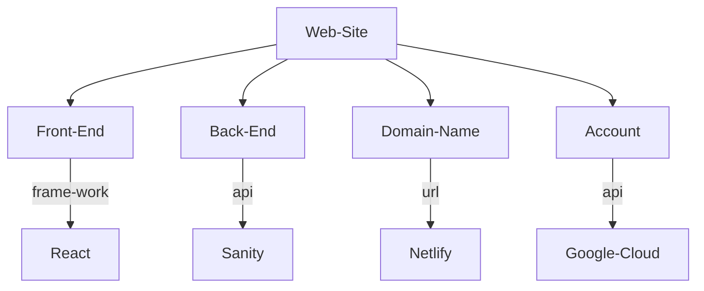

# 蕭舜昕的學生專題
> 自己的系有自己的版-社群媒體網頁實作
## :book:簡介
2022年12月15日。111學年度實踐大學跨校專題暨競賽。參賽作品。
## :raising_hand_man:個人檔案
蕭舜昕。輔仁大學進修部軟體工程與數位創意學系。四年級。
## :point_right:怎麼看懂、運用這個專題
1. 了解使用者介面設計
   * 請點進[frontend->src->components]()觀看每一個.jsx檔案。
2. 了解資料庫的資列結構
   * 請點進[backend->schemas]()觀看每一個.js檔案。
3. 2022年7月Google OAuth新政策
   * 請點進[frontend->src->index.js]()觀看Google OAuth要包覆的範圍。
   * 請點進[frontend->src->components->Login.jsx]()觀看Login function所要解碼(decode)的credential response方式。
## :hammer_and_wrench:用到的技術
1. 前端
   1. 網頁設計
      1. React
      2. Tailwind CSS
   2. 使用者登入
      1. Google Cloud
2. 後端
   1. 資料庫
      1. Sanity
3. 部署
   1. 網域代管
      1. Netlify
   2. 版本控制
      1. Github
## :building_construction:專題網站的架構

## :page_facing_up:專題相關文件
1. 專題報告書
   * URL:https://docs.google.com/document/d/1Y0vA1FeONLoPKLL683QHWnx2xdgTAM9DwlLq8jKfiVc/edit?usp=sharing
2. 需求規格書
   * URL:https://docs.google.com/document/d/1klQh3hYoyf3J5ZgDXzu_unH0WM0c3wfhsH0Qj-yKucs/edit?usp=sharing
## 參考資源
1. adrianhajdin(2022)。project_share_me_social_media。
   * URl:https://github.com/adrianhajdin/project_shareme_social_media
   * Credit:@github/adrianhajdin。Best Repository & Resource Ever!:+1:
## English Introduction
